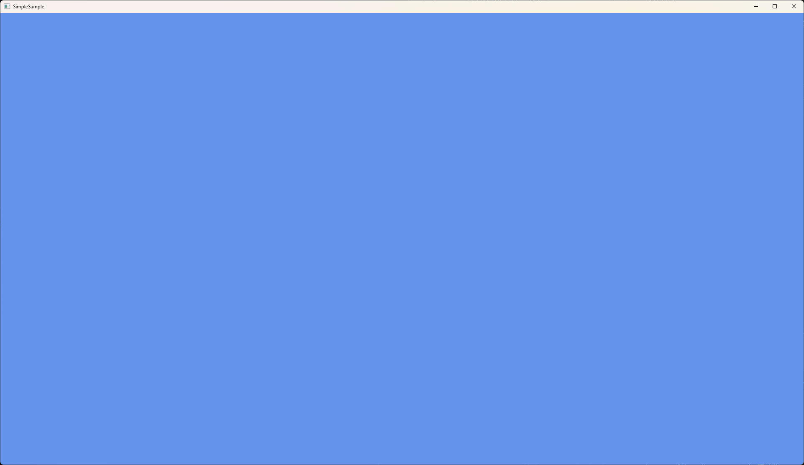
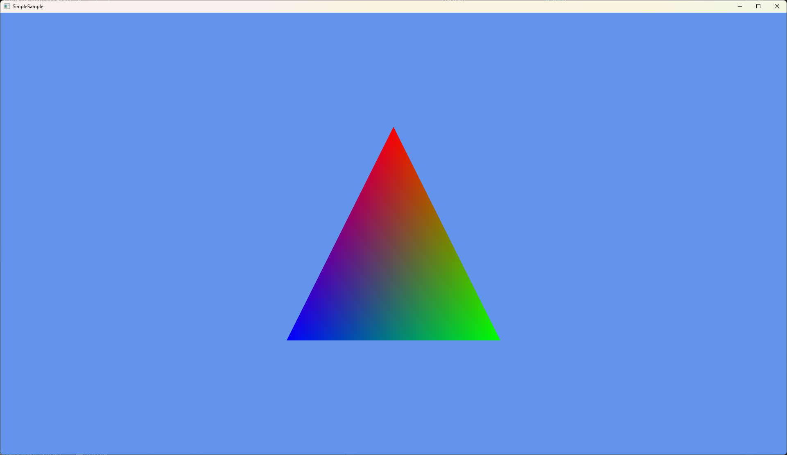
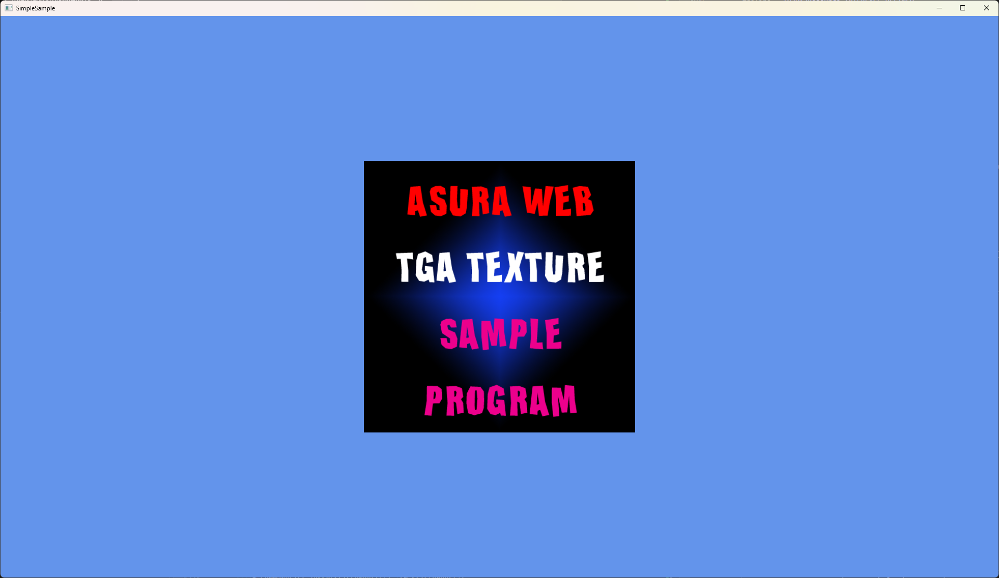
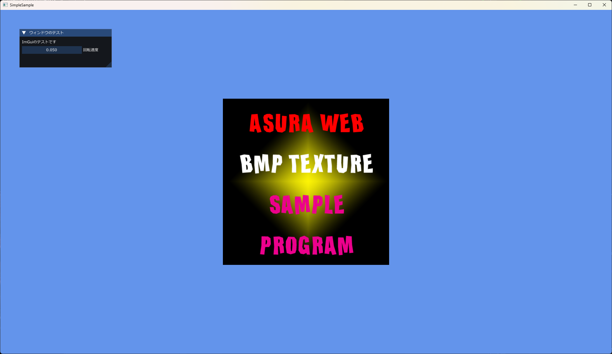

# d3d12_samples

Direct3D 12 を用いたサンプルプログラムです。  

## サンプル一覧

### d3d12_window
ウィンドウを生成して，画面クリアする最も単純なサンプルプログラムです。  
解説記事は XXX を参照してください。  

### d3d12_polygon
頂点シェーダとピクセルシェーダを使って1枚のポリゴンを描画するサンプルプログラムです。  
解説記事は XXX を参照してください。  

### d3d12_texture
1枚のテクスチャをテクスチャマッピングするサンプルプログラムです。  
このサンプルプログラムではGPU Upload Heapsを対応しています。  
解説記事は XXX を参照してください。
  

### d3d12_imgui
ImGuiを使用するサンプルプログラムです。  
解説記事は XXX を参照してください。  
  